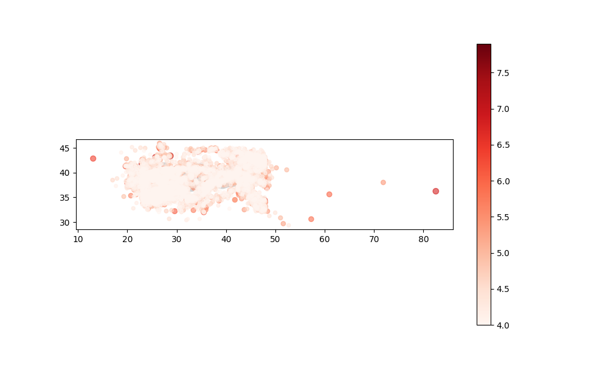
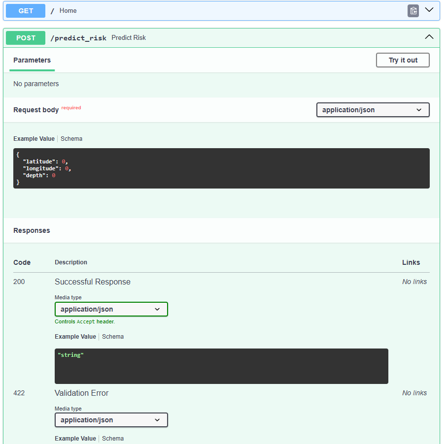
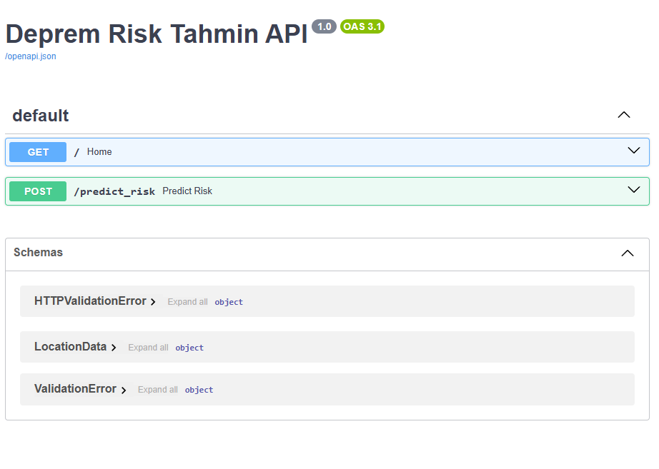

# 🌍 Turkey Earthquake Risk Prediction & Visualization API

This project is a **Machine Learning (Random Forest)** and **REST API (FastAPI)** application designed to predict potential seismic risk scores based on historical earthquake data. It includes a geographical visualization module using **GeoPandas** to map seismic activities across Turkey.

## 🚀 Features

* **Machine Learning:** Predicts earthquake magnitude risk using a trained `RandomForestRegressor`.
* **Interactive API:** Built with **FastAPI**, featuring automatic **Swagger UI** documentation.
* **Geospatial Visualization:** Maps historical seismic data with color-coded magnitudes on a Turkish map.
* **Clean Architecture:** Modular structure for easy maintenance and scalability.

---

## 📸 Screenshots & Visualization

### 1. Seismic Distribution Map
This map is generated via `src/visualize.py`. It provides a visual density of historical earthquakes where the color intensity and point size reflect the magnitude.



### 2. API Documentation (Swagger UI)
The main API interface accessible via browser. It allows for easy navigation of available endpoints.



### 3. Live Prediction Test
You can test the machine learning model in real-time by providing coordinates (Latitude, Longitude, Depth).




---

## 🛠️ Technologies Used

* **Core:** Python 3.10+
* **Backend:** FastAPI, Uvicorn
* **ML & Data:** Scikit-Learn, Pandas, Joblib
* **Visualization:** GeoPandas, Matplotlib


## 📂 Project Structure

```text
earthquake-risk/
├── data/
│   └── earthquake_data.csv    # Historical dataset
├── images/                    # Visual assets for README
│   ├── 1.png                  # Swagger Home
│   ├── 2.png                  # Prediction Test
│   └── Figure_1.png           # Map Visualization
├── models/
│   └── risk_model.pkl         # Serialized ML model
├── src/
│   ├── data_loader.py         # Preprocessing logic
│   ├── train.py               # Training script
│   └── visualize.py           # Map plotting script
├── app.py                     # API entry point
└── requirements.txt           # Dependencies